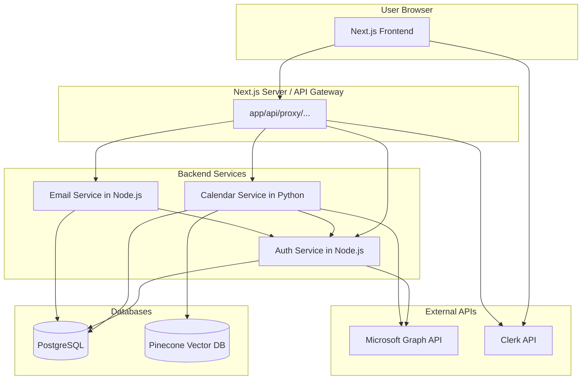

# Service Communication Architecture

This document outlines the communication patterns between the various components of the Briefly application.

## 1. Frontend to Backend Communication

-   The **Next.js frontend** (`app/*`) communicates with its own backend API routes, primarily `app/api/proxy/[...service].ts`.
-   These Next.js API routes act as an **API Gateway/Proxy**:
    -   They receive requests from the frontend.
    -   They handle authentication/authorization (using NextAuth.js/Clerk session information).
    -   They forward requests to the appropriate backend microservices (`calendar-service`, `email-service`, `auth-service`).
-   **Communication Protocol:** HTTPS (JSON for data exchange).
-   **Benefits:**
    -   Simplifies frontend logic (single backend endpoint).
    -   Centralizes cross-cutting concerns (auth, rate limiting) at the proxy layer.
    -   Avoids CORS issues with direct frontend-to-microservice calls.

## 2. Inter-Service Communication (Backend Microservices)

-   Backend microservices (`services/calendar-service/`, `services/email-service/`, `services/auth-service/`) communicate with each other via direct **HTTP/REST API calls**.
-   **Service Discovery:** Docker Compose internal DNS (e.g., `calendar-service` calls `auth-service` at `http://auth-service:<port>`).
-   All services expose well-defined RESTful APIs for internal communication.
-   **Communication Protocol:** HTTP (JSON for data exchange).
-   **Example:** `calendar-service` might fetch user details from `auth-service`.

## 3. Service to Database Communication

-   Backend services requiring persistent storage connect directly to the **PostgreSQL database** (the `db` service in `docker-compose.yml`).
-   **Node.js services** (`email-service`, `auth-service`) use Prisma as their ORM.
-   **Python services** (`calendar-service`) will use a suitable Python ORM (e.g., SQLAlchemy) or a direct database driver (e.g., `psycopg2`).
-   **Communication Protocol:** TCP/IP (SQL).

## 4. Service to External Services

-   **Pinecone Vector Database:**
    -   The `calendar-service` (RAG pipeline) and `services/vector-db/indexing_service.py` communicate directly with Pinecone.
    -   **Protocol:** HTTPS (Pinecone SDK).
-   **Microsoft Graph API:**
    -   The `auth-service` and potentially `calendar-service` interact with Microsoft Graph API.
    -   **Protocol:** HTTPS (Microsoft Graph SDK / REST API).
    -   Secure token management is critical.
-   **Clerk Authentication:**
    -   Next.js frontend interacts with Clerk for UI and client-side auth.
    -   Next.js API routes (proxy) use Clerk's backend SDK for token verification.
    -   **Protocol:** HTTPS (Clerk SDK / REST API).

## 5. Data Format

-   **JSON** is the standard data interchange format for all API requests and responses (both internal and external where applicable).

## 6. Asynchronous Communication

-   **Initial Approach (MVP):** Primarily synchronous request-response API calls.
-   **Email Service:** May handle email sending asynchronously internally (e.g., add to an internal queue after API request) to avoid blocking the caller.
-   **Future Considerations:** If complex asynchronous workflows or event-driven patterns are needed, a dedicated message queue (e.g., RabbitMQ, Kafka) could be introduced. This is out of scope for the MVP.

## Diagram (Conceptual)

