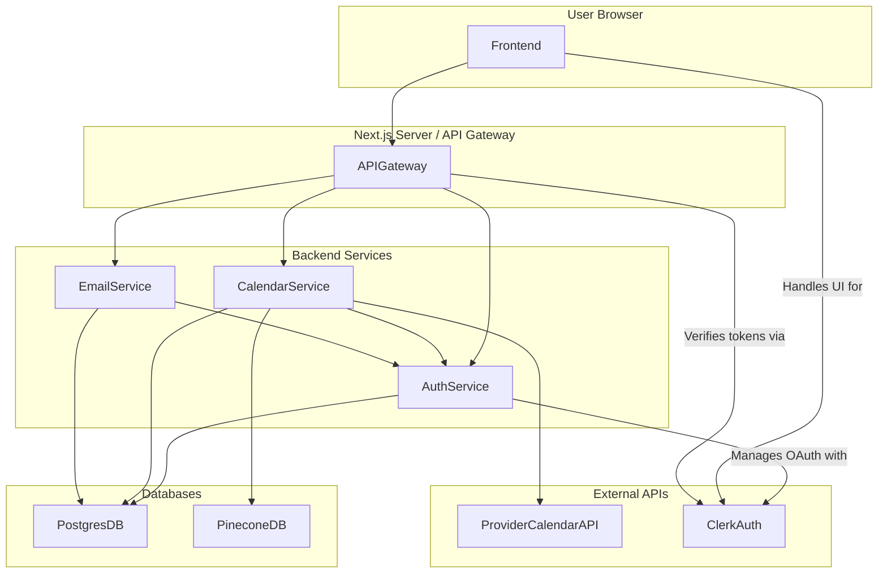

# Service Communication Architecture

This document outlines the communication patterns between the various components of the Briefly application.

## 1. Frontend to Backend Communication

-   The **Next.js frontend** (`app/*`) communicates with its own backend API routes, primarily `app/api/proxy/[...service].ts`.
-   These Next.js API routes act as an **API Gateway/Proxy**:
    -   They receive requests from the frontend.
    -   They handle authentication/authorization (using NextAuth.js/Clerk session information).
    -   They forward requests to the appropriate backend microservices (`office-service`, `chat-service`, `user-service`).
-   **Communication Protocol:** HTTPS (JSON for data exchange).
-   **Benefits:**
    -   Simplifies frontend logic (single backend endpoint).
    -   Centralizes cross-cutting concerns (auth, rate limiting) at the proxy layer.
    -   Avoids CORS issues with direct frontend-to-microservice calls.

## 2. Inter-Service Communication (Backend Microservices)

-   Backend microservices (`services/office-service/`, `services/email-service/`, `services/user-service/`) communicate with each other via direct **HTTP/REST API calls**.
-   **Service Discovery:** Docker Compose internal DNS (e.g., `office-service` calls `user-service` at `http://user-service:<port>`).
-   All services expose well-defined RESTful APIs for internal communication.
-   **Communication Protocol:** HTTP (JSON for data exchange).
-   **Example:** `office-service` might fetch user details from `user-service`.

## 3. Service to Database Communication

-   Backend services requiring persistent storage connect directly to the **PostgreSQL database** (the `db` service in `docker-compose.yml`).
-   **Python services** (`user-service`, `chat-service`, `office-service`) will use a suitable Python ORM (e.g., SQLAlchemy) or a direct database driver (e.g., `psycopg2`).
-   **Communication Protocol:** TCP/IP (SQL).

## 4. Service to External Services

-   **Pinecone Vector Database:**
    -   The `office-service` (RAG pipeline) and `services/vector-db/indexing_service.py` communicate directly with Pinecone.
    -   **Protocol:** HTTPS (Pinecone SDK).
-   **Microsoft Graph API:**
    -   The `user-service` and potentially `office-service` interact with Microsoft Graph API.
    -   **Protocol:** HTTPS (Microsoft Graph SDK / REST API).
    -   Secure token management is critical.
-   **Clerk Authentication:**
    -   Next.js frontend interacts with Clerk for UI and client-side auth.
    -   Next.js API routes (proxy) use Clerk's backend SDK for token verification.
    -   **Protocol:** HTTPS (Clerk SDK / REST API).

## 5. Data Format

-   **JSON** is the standard data interchange format for all API requests and responses (both internal and external where applicable).

## 6. Asynchronous Communication

-   **Initial Approach (MVP):** Primarily synchronous request-response API calls.
-   **Email Service:** May handle email sending asynchronously internally (e.g., add to an internal queue after API request) to avoid blocking the caller.
-   **Future Considerations:** If complex asynchronous workflows or event-driven patterns are needed, a dedicated message queue (e.g., RabbitMQ, Kafka) could be introduced. This is out of scope for the MVP.

## Diagram (Conceptual)

## 7. Security Considerations for Token Handling

- **Clerk Manages Primary OAuth Tokens:** Clerk securely stores the long-lived OAuth refresh tokens obtained from providers like Microsoft. Our application does not store these.
- **Short-Lived Access Tokens:** Microsoft Graph access tokens retrieved via Clerk are short-lived and fetched on-demand by backend services (e.g., via `/services/frontend/app/api/get-ms-token/route.ts`).
- **No Application-Side Storage of Access Tokens:** These short-lived access tokens are not persistently stored in our application's database.
- **HTTPS Everywhere:** All communication involving tokens (frontend to backend, backend to backend, backend to external APIs) must be over HTTPS in production.
- **Backend-Only Handling:** Sensitive access tokens (like Microsoft Graph tokens) must remain on the backend and not be exposed to the client-side browser.
- **Avoid Logging Tokens:** Ensure access tokens are not inadvertently logged in production. Log errors and non-sensitive metadata only.
- **Principle of Least Privilege:** OAuth scopes requested should be strictly limited to what the application requires for its functionality. 

## 8. User Configuration and Settings Management

-   The **`user-service`** is the central authority for managing user-specific configurations and preferences.
-   **Storage:** These settings are stored in the `User` model within the PostgreSQL database, managed by `user-service` using Prisma.
    -   `calendarProvider`: Stores the user's primary connected calendar service (e.g., "microsoft", "google"). This helps other services, like `office-service`, know which provider-specific logic to use.
    -   `userSettings`: A JSONB field storing various user preferences, including:
        -   `timezone`: The user's preferred IANA timezone ID (e.g., "America/New_York"). This is crucial for `office-service` to fetch events for the user's actual local day and for `email-service` to schedule notifications appropriately.
        -   `morningEmailTime`: The user's preferred time to receive daily summary emails (e.g., "08:00" in their local timezone).
        -   Other future preferences as needed.
-   **API Access:** `user-service` will provide secure API endpoints (e.g., extending `GET /users/profile` and `PUT /users/profile`) for:
    -   The frontend to allow users to view and update their settings.
    -   Other backend services (like `office-service` and `email-service`) to fetch these settings when processing user-specific tasks. Services will typically use the Clerk User ID (passed from the API Gateway) to identify the user when querying `user-service`.

## 9. Multi-Calendar Provider Support (`office-service`)

To support various calendar providers (e.g., Microsoft Outlook, Google Calendar), the `office-service` will implement an abstraction layer:

-   **Provider Interface:** An abstract base class (ABC) or interface (e.g., `CalendarProvider`) will define a common set of operations, such as `get_events(token, start_datetime, end_datetime, user_timezone)`.
-   **Concrete Implementations:** Specific classes will implement this interface for each supported provider:
    -   `MicrosoftGraphProvider`: Handles interactions with the Microsoft Graph API.
    -   `GoogleCalendarProvider` (Future): Handles interactions with the Google Calendar API.
-   **Dispatch Logic:** When `office-service` receives a request (e.g., to fetch events):
    1.  **Token & Configuration Retrieval:** The access token for the specific calendar provider is expected to be passed in the request (typically sourced from Clerk by the frontend/API gateway).
    2.  The `office-service` API will accept `provider_type: str` (e.g., "microsoft", "google") and `user_timezone: str` as parameters. 
        -   *(Long-term evolution: `provider_type` and `user_timezone` could be fetched from `user-service` by `office-service` itself, using the authenticated user's ID. For initial implementation, passing them as parameters is simpler.)*
    3.  It instantiates the appropriate provider implementation (e.g., `MicrosoftGraphProvider`) based on the `provider_type`.
    4.  It calls the method (e.g., `get_events`) on the instantiated provider, passing the token, date/time parameters, and the `user_timezone`.
-   **Benefits:** This approach decouples the core logic of `office-service` from the specifics of each calendar API, making it easier to add new providers or update existing ones.

## 10. Cloud-Hosted PostgreSQL (e.g., Neon, AWS RDS)

Our application is designed to work with standard PostgreSQL databases. Switching to a cloud-hosted PostgreSQL provider like Neon, Supabase, or AWS RDS is primarily a configuration change.

-   **`DATABASE_URL` Environment Variable:** All services that connect to PostgreSQL (e.g., `user-service`, `office-service`, `email-service`) are configured via the `DATABASE_URL` environment variable.
    -   Prisma (used in Node.js services) natively supports this.
    -   Python services will also be configured to use this standard environment variable.
-   **Local Development:** In `docker-compose.yml`, the `db` service provides a local PostgreSQL instance, and the `DATABASE_URL` for other services points to this (e.g., `postgresql://user:password@db:5432/mydatabase`).
-   **Production Deployment:**
    -   When deploying to a production environment (e.g., using Docker on a cloud provider), you would not deploy the `db` service from `docker-compose.yml`.
    -   Instead, you would provision a PostgreSQL database from a cloud provider (Neon, AWS RDS, Google Cloud SQL, Azure Database for PostgreSQL, etc.).
    -   The `DATABASE_URL` for your deployed application services would then be updated to point to the connection string provided by your cloud PostgreSQL provider.
    -   This connection string typically includes the username, password, host, port, and database name for the cloud-hosted instance.
-   **No Code Changes Required:** Due to the abstraction provided by `DATABASE_URL` and standard database connectors/ORMs, no code changes are generally needed in the application services to switch from a local Dockerized PostgreSQL to a cloud-hosted one.
-   **SSL/TLS:** Ensure that the `DATABASE_URL` includes appropriate parameters for SSL/TLS connections if required by your cloud provider (e.g., `?sslmode=require`). Prisma and most database drivers support this. 