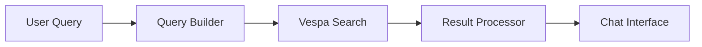
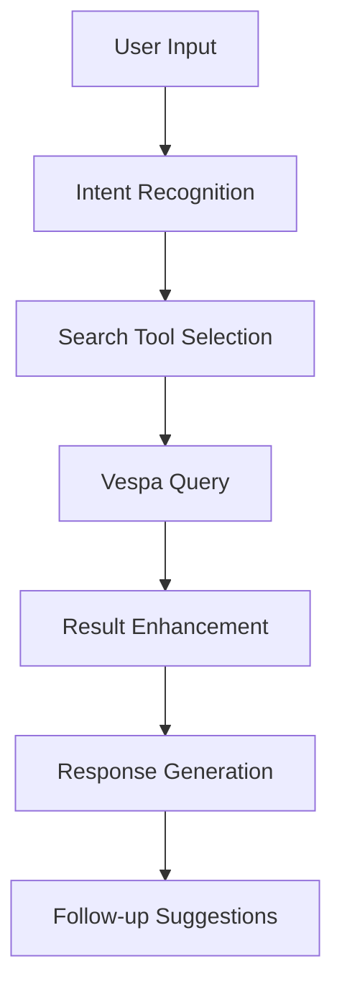

# Vespa Demo Services

This directory contains comprehensive demonstration services for the Vespa-powered hybrid search system. These demos showcase end-to-end functionality including data ingestion, indexing, search capabilities, and chat integration.

## 🚀 Quick Demo Flow

**Complete end-to-end demo in 4 steps:**

```bash
# 1. Start all services with human-readable logging
./scripts/start-dev-logs.sh

# 2. Clear existing data from Vespa
./scripts/vespa.sh --clear-data --email {email} --env-file {env_file} --force

# 3. Backfill with fresh data
python services/demos/vespa_backfill.py

# 4. Search and dump results
python services/demos/vespa_search.py {email} --dump
```


**Quick Reference:**
```bash
# Check status and auto-start if needed
./scripts/vespa.sh

# Start all services
./scripts/vespa.sh --start

# Deploy Briefly application
./scripts/vespa.sh --deploy

# Show status
./scripts/vespa.sh --status

# Stop everything
./scripts/vespa.sh --stop

# Clear all data (useful for testing)
./scripts/vespa.sh --clear-data

# Restart all services
./scripts/vespa.sh --restart

# Clean up containers
./scripts/vespa.sh --cleanup
```

**Note**: Replace `{email}` with actual email address and `{env_file}` with path to environment file containing API keys.

## Demo Scripts

### 1. Vespa Backfill Demo (`vespa_backfill.py`)
**Purpose**: Data ingestion and backfill job testing
**Features**: 
- Backfill job management
- Email crawling from Microsoft Graph and Gmail
- Document indexing to Vespa
- Pub/Sub integration
- Progress monitoring

**Usage**:
```bash
python services/demos/vespa_backfill.py
```

**Note**: This demo runs once to populate Vespa with data, then `vespa_search.py` can be run multiple times to test search capabilities.

### 2. Vespa Search Demo (`vespa_search.py`)
**Purpose**: Comprehensive search capabilities testing and benchmarking
**Features**: 
- Basic search functionality testing
- User isolation testing
- Source type filtering
- Semantic search testing
- Performance benchmarking
- Advanced ranking profiles (hybrid, BM25, semantic)
- Response time analysis
- Search quality assessment

**Usage**:
```bash
python services/demos/vespa_search.py
```

### 3. Vespa Query Demo (`vespa_query.py`)
**Purpose**: Direct query testing with detailed output
**Features**:
- Direct Vespa query execution
- Detailed result dumping with `--dump` flag
- User-specific data filtering
- Query performance analysis
- Raw Vespa response inspection

**Usage**:
```bash
# Basic query test
python services/demos/vespa_query.py trybriefly@outlook.com

# Detailed output with dump flag
python services/demos/vespa_query.py trybriefly@outlook.com --dump
```

**Note**: This demo can be run multiple times to test different search scenarios and measure performance.

### 3. Vespa Synthetic Demo (`vespa_synthetic.py`)
**Purpose**: Conversational search experience with follow-up questions
**Features**:
- Multi-turn conversation scenarios
- Context-aware follow-up questions
- Cross-platform data search
- Person-centric search
- Time-scoped search
- Relevance scoring
- Performance metrics

**Usage**:
```bash
python services/demos/vespa_synthetic.py
```

**Configuration**:
```json
{
  "vespa_endpoint": "http://localhost:8080",
  "demo_user_id": "demo_user_1",
  "conversation_scenarios": [
    "email_search",
    "calendar_lookup",
    "contact_finding",
    "multi_source_query"
  ]
}
```

**Output**: Chat interaction logs, search quality metrics, and UX performance data

### 3. Backfill Manager (`backfill_manager.py`)

**Purpose**: Orchestration and management of data backfill operations

**Features**:
- Job lifecycle management
- Concurrency control
- Timeout handling
- Job history tracking
- Performance monitoring

**Usage**:
```python
from services.demos.backfill_manager import BackfillManager

manager = BackfillManager()
job_id = await manager.start_backfill_job(user_id, request)
status = await manager.get_job_status(job_id)
```

**Key Methods**:
- `start_backfill_job()` - Start new backfill operation
- `pause_job()` - Pause running job
- `resume_job()` - Resume paused job
- `cancel_job()` - Cancel and cleanup job
- `get_job_summary()` - Get performance statistics

## Demo Data Seeding

### Seed Demo Data Script (`seed-demo-data.py`)

**Purpose**: Generate and publish synthetic data for testing

**Features**:
- Realistic email content generation
- Calendar event creation
- Contact information synthesis
- Batch publishing to Pub/Sub
- Configurable data volumes

**Usage**:
```bash
cd scripts
python seed-demo-data.py --user-id demo_user_1 --email-count 100 --calendar-count 50 --contact-count 25
```

**Data Types Generated**:
- **Emails**: Subject, body, sender, recipients, timestamps, folders
- **Calendar Events**: Title, description, attendees, location, duration
- **Contacts**: Name, email, phone, company, role

## Demo Scenarios

### 1. Data Ingestion Flow


**Steps**:
1. Generate synthetic data using seed script
2. Publish to appropriate Pub/Sub topics
3. Vespa loader processes and indexes data
4. Verify indexing completion
5. Test search functionality

### 2. Search Integration



**Features**:
- Hybrid search (BM25 + vector similarity)
- User isolation and data filtering
- Faceted search and filtering
- Autocomplete suggestions
- Similar document recommendations

### 3. Chat Workflow



**Capabilities**:
- Natural language query understanding
- Context-aware search refinement
- Multi-turn conversation support
- Actionable result presentation

## Configuration

### Environment Variables

```bash
# Vespa Configuration
VESPA_ENDPOINT=http://localhost:8080
VESPA_APPLICATION=briefly

# Vespa Services Configuration
VESPA_LOADER_PORT=9001
VESPA_QUERY_PORT=9002

# Pub/Sub Configuration
PUBSUB_PROJECT_ID=briefly-dev
PUBSUB_EMULATOR_HOST=localhost:8085

# Demo Configuration
DEMO_USER_ID=demo_user_1
DEMO_DATA_COUNT=100
DEMO_PROVIDERS=microsoft,google
```

### Configuration Files

**config.json**:
```json
{
  "vespa": {
    "endpoint": "http://localhost:8080",
    "application": "briefly",
    "timeout": 30
  },
  "pubsub": {
    "project_id": "briefly-dev",
    "emulator_host": "localhost:8085"
  },
  "services": {
    "vespa_loader": "http://localhost:9001",
    "vespa_query": "http://localhost:9002"
  },
  "demo": {
    "users": ["demo_user_1", "demo_user_2"],
    "providers": ["microsoft", "google"],
    "data_volumes": {
      "emails": 100,
      "calendar_events": 50,
      "contacts": 25
    }
  }
}
```

## Starting Backend Services

### Demo Flow: Infrastructure + Data Operations

The Vespa demo requires two types of scripts working together:

**Infrastructure Management** (using `vespa.sh`):
- Manages Vespa Docker container
- Deploys Briefly application configuration
- Handles data clearing operations

**Data Operations** (using Python scripts in `demos/`):
- `vespa_backfill.py` - Ingests and indexes data
- `vespa_search.py` - Performs searches and dumps results
- `vespa_synthetic.py` - Tests conversational search

### Option 1: Use the Consolidated Management Script (Recommended)

The new `./scripts/vespa.sh` script consolidates all Vespa management functionality that was previously spread across multiple scripts:

**What it manages:**
- ✅ **Vespa Container**: Docker container running Vespa engine
- ✅ **Briefly Application**: Deploys your Vespa configuration from `vespa/` directory
- ✅ **Python Services**: Vespa Loader Service (port 9001) and Query Service (port 9002)

**Key benefits:**
- 🚀 **Single command**: One script to manage everything
- 🔍 **Smart health checks**: Automatically starts services if they're down
- 📦 **Briefly deployment**: Properly deploys your `vespa/services.xml`, `vespa/hosts.xml`, and `vespa/schemas/` configuration
- 📊 **Real-time monitoring**: Live log monitoring during deployment
- 🛠️ **Comprehensive management**: Start, stop, deploy, status, restart, cleanup operations

The `vespa.sh` script manages all Vespa services in one place:

```bash
# Start all Vespa services (Vespa Engine, Loader Service, Query Service)
./scripts/vespa.sh --start

# Check status
./scripts/vespa.sh --status

# Stop all services
./scripts/vespa.sh --stop

# Clean up container
./scripts/vespa.sh --cleanup

# Restart all services
./scripts/vespa.sh --restart

# Deploy Briefly application to Vespa
./scripts/vespa.sh --deploy
```

**Note**: The Pub/Sub emulator is managed separately by `scripts/local-pubsub.sh` to avoid conflicts and provide better isolation.


### Option 3: Start Services Individually

#### Start Pub/Sub Emulator
```bash
# Start Pub/Sub emulator (manages Docker container)
./scripts/local-pubsub.sh

# Check status
./scripts/local-pubsub.sh --status

# Stop emulator
./scripts/local-pubsub.sh --stop

# Clean up container
./scripts/local-pubsub.sh --cleanup
```

#### Start Vespa Engine
```bash
# Start Vespa container
docker run -d --name vespa --hostname vespa-container \
  -p 8080:8080 -p 19092:19092 \
  vespaengine/vespa
```

#### Start Vespa Loader Service
```bash
cd services/vespa_loader
python -m uvicorn main:app --host 0.0.0.0 --port 9001 --reload
```

#### Start Vespa Query Service
```bash
cd services/vespa_query
python -m uvicorn main:app --host 0.0.0.0 --port 9002 --reload
```

## Running Demos

### Complete Demo Flow
The full Vespa demo workflow involves both infrastructure management and data operations:

1. **Start Services**: `./scripts/start-dev-logs.sh` - Start all services with human-readable logging
2. **Clear Data**: `./scripts/vespa.sh --clear-data --email {email} --env-file {env_file}` - Clear existing data from Vespa
3. **Backfill Data**: `python services/demos/vespa_backfill.py` - Populate Vespa with fresh data
4. **Search & Dump**: `python services/demos/vespa_search.py {email} --dump` - Search and dump all content for the user

### Individual Demo Scripts
1. **First time setup**: Run `vespa_backfill.py` once to populate Vespa with data
2. **Search testing**: Run `vespa_search.py` multiple times to test different scenarios
3. **Conversational testing**: Run `vespa_synthetic.py` to test chat-like interactions

### 1. Data Ingestion (`vespa_backfill.py`)
Populate Vespa with data (run once):

```bash
python services/demos/vespa_backfill.py
```

### 2. Search Testing (`vespa_search.py`)
Test comprehensive search capabilities (run multiple times):

```bash
python services/demos/vespa_search.py
```

### 3. Conversational Search (`vespa_synthetic.py`)
Test conversational search with follow-up questions:

```bash
python services/demos/vespa_synthetic.py
```

## Performance Metrics

### Search Performance

- **Query Response Time**: Target < 100ms for simple queries
- **Throughput**: Target > 100 queries/second
- **Latency P95**: Target < 200ms
- **Indexing Speed**: Target > 1000 documents/second

### Data Quality

- **Completeness**: All required fields populated
- **Accuracy**: Data matches source expectations
- **Consistency**: Cross-reference integrity maintained
- **Freshness**: Real-time updates working correctly

## Troubleshooting

### Common Issues

1. **Vespa connection failed**:
   - Check if Vespa container is running
   - Verify endpoint URL and port
   - Check Vespa application status

2. **Pub/Sub publishing failed**:
   - Verify emulator is running
   - Check topic creation
   - Verify message format

3. **Search returns no results**:
   - Check if data was indexed
   - Verify user_id filtering
   - Check query syntax

4. **Performance degradation**:
   - Monitor Vespa resource usage
   - Check query complexity
   - Verify index optimization

### Debug Commands

```bash
# Check Vespa status
curl http://localhost:8080/ApplicationStatus

# Check Vespa metrics
curl http://localhost:8080/metrics/v2/values

# Check Pub/Sub topics
gcloud pubsub topics list --project=briefly-dev

# Check service logs
tail -f services/vespa_query/logs/app.log
```

## Development

### Adding New Demo Scenarios

1. **Create scenario class**:
   ```python
   class NewScenario:
       def __init__(self, config):
           self.config = config
       
       async def run(self):
           # Implementation
           pass
   ```

2. **Add to demo runner**:
   ```python
   scenarios = [
       EmailSearchScenario(config),
       CalendarScenario(config),
       NewScenario(config)
   ]
   ```

3. **Update configuration**:
   ```json
   {
     "scenarios": ["email_search", "calendar", "new_scenario"]
   }
   ```

### Extending Demo Data

1. **Add new data types** to seed script
2. **Update Pub/Sub publishing** logic
3. **Extend Vespa schema** if needed
4. **Update search queries** for new fields

## Monitoring and Observability

### Metrics Collection

- **Performance metrics**: Response times, throughput
- **Data quality metrics**: Completeness, accuracy scores
- **User experience metrics**: Success rates, error rates
- **System health metrics**: Service availability, resource usage

### Logging

- **Structured logging** with consistent format
- **Log levels** appropriate for production
- **Correlation IDs** for request tracing
- **Performance markers** for timing analysis

## Future Enhancements

### Planned Features

1. **Real-time data streaming** from live APIs
2. **Advanced analytics** and insights
3. **Multi-language support** for international users
4. **Mobile-optimized** demo interfaces
5. **A/B testing** framework for search improvements

### Integration Opportunities

1. **CI/CD pipeline** integration
2. **Automated testing** in staging environments
3. **Performance regression** detection
4. **User feedback** collection and analysis
5. **Production deployment** automation

## Contributing

### Development Guidelines

1. **Follow existing patterns** for consistency
2. **Add comprehensive tests** for new features
3. **Update documentation** for any changes
4. **Use type hints** and follow PEP 8
5. **Handle errors gracefully** with proper logging

### Testing

```bash
# Run all tests
cd services/demos
python -m pytest tests/ -v

# Run specific demo tests
python -m pytest tests/test_vespa_full.py -v

# Run with coverage
python -m pytest tests/ --cov=. --cov-report=html
```

## Support

For questions or issues with the Vespa demo services:

1. **Check logs** for error details
2. **Review configuration** for common issues
3. **Test individual components** to isolate problems
4. **Consult Vespa documentation** for advanced topics
5. **Create issue** in project repository

---

*This README is maintained as part of the Vespa demo implementation. For updates or corrections, please submit a pull request.*
