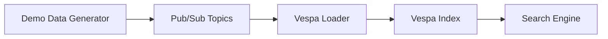
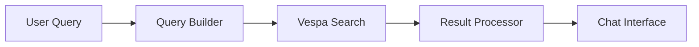
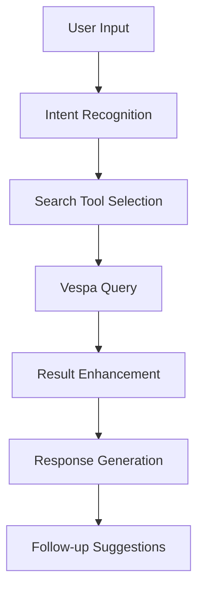

# Vespa Demo Services

This directory contains comprehensive demonstration services for the Vespa-powered hybrid search system. These demos showcase end-to-end functionality including data ingestion, indexing, search capabilities, and chat integration.

## Overview

The Vespa demo services provide:
- **Full-stack demonstrations** of the Vespa data pipeline
- **Interactive chat experiences** with search integration
- **Performance benchmarking** and optimization insights
- **Data quality validation** and consistency checks
- **Real-world usage scenarios** for testing and development

## Demo Services

### 1. Vespa Full Demo (`vespa_full.py`)

**Purpose**: End-to-end demonstration of the complete Vespa system

**Features**:
- Data seeding across multiple users and providers
- Vespa indexing verification
- Comprehensive search testing
- Performance benchmarking
- Data quality validation

**Usage**:
```bash
cd services/demos
python vespa_full.py --config config.json
```

**Configuration**:
```json
{
  "vespa_endpoint": "http://localhost:8080",
  "demo_users": ["demo_user_1", "demo_user_2"],
  "demo_providers": ["microsoft", "google"],
  "data_counts": {
    "emails": 100,
    "calendar_events": 50,
    "contacts": 25
  }
}
```

**Output**: Comprehensive report with performance metrics, search results, and data quality scores

### 2. Vespa Chat Demo (`vespa_chat.py`)

**Purpose**: Interactive chat experience with Vespa search integration

**Features**:
- Simulated conversation scenarios
- Real-time search integration
- Context-aware follow-up handling
- Search quality assessment
- User experience metrics

**Usage**:
```bash
cd services/demos
python vespa_chat.py --config vespa_config.json
```

**Configuration**:
```json
{
  "vespa_endpoint": "http://localhost:8080",
  "demo_user_id": "demo_user_1",
  "conversation_scenarios": [
    "email_search",
    "calendar_lookup",
    "contact_finding",
    "multi_source_query"
  ]
}
```

**Output**: Chat interaction logs, search quality metrics, and UX performance data

### 3. Backfill Manager (`backfill_manager.py`)

**Purpose**: Orchestration and management of data backfill operations

**Features**:
- Job lifecycle management
- Concurrency control
- Timeout handling
- Job history tracking
- Performance monitoring

**Usage**:
```python
from services.demos.backfill_manager import BackfillManager

manager = BackfillManager()
job_id = await manager.start_backfill_job(user_id, request)
status = await manager.get_job_status(job_id)
```

**Key Methods**:
- `start_backfill_job()` - Start new backfill operation
- `pause_job()` - Pause running job
- `resume_job()` - Resume paused job
- `cancel_job()` - Cancel and cleanup job
- `get_job_summary()` - Get performance statistics

## Demo Data Seeding

### Seed Demo Data Script (`seed-demo-data.py`)

**Purpose**: Generate and publish synthetic data for testing

**Features**:
- Realistic email content generation
- Calendar event creation
- Contact information synthesis
- Batch publishing to Pub/Sub
- Configurable data volumes

**Usage**:
```bash
cd scripts
python seed-demo-data.py --user-id demo_user_1 --email-count 100 --calendar-count 50 --contact-count 25
```

**Data Types Generated**:
- **Emails**: Subject, body, sender, recipients, timestamps, folders
- **Calendar Events**: Title, description, attendees, location, duration
- **Contacts**: Name, email, phone, company, role

## Demo Scenarios

### 1. Data Ingestion Flow



**Steps**:
1. Generate synthetic data using seed script
2. Publish to appropriate Pub/Sub topics
3. Vespa loader processes and indexes data
4. Verify indexing completion
5. Test search functionality

### 2. Search Integration



**Features**:
- Hybrid search (BM25 + vector similarity)
- User isolation and data filtering
- Faceted search and filtering
- Autocomplete suggestions
- Similar document recommendations

### 3. Chat Workflow



**Capabilities**:
- Natural language query understanding
- Context-aware search refinement
- Multi-turn conversation support
- Actionable result presentation

## Configuration

### Environment Variables

```bash
# Vespa Configuration
VESPA_ENDPOINT=http://localhost:8080
VESPA_APPLICATION=briefly

# Pub/Sub Configuration
PUBSUB_PROJECT_ID=briefly-dev
PUBSUB_EMULATOR_HOST=localhost:8085

# Demo Configuration
DEMO_USER_ID=demo_user_1
DEMO_DATA_COUNT=100
DEMO_PROVIDERS=microsoft,google
```

### Configuration Files

**config.json**:
```json
{
  "vespa": {
    "endpoint": "http://localhost:8080",
    "application": "briefly",
    "timeout": 30
  },
  "pubsub": {
    "project_id": "briefly-dev",
    "emulator_host": "localhost:8085"
  },
  "demo": {
    "users": ["demo_user_1", "demo_user_2"],
    "providers": ["microsoft", "google"],
    "data_volumes": {
      "emails": 100,
      "calendar_events": 50,
      "contacts": 25
    }
  }
}
```

## Running Demos

### Prerequisites

1. **Vespa running locally**:
   ```bash
   docker run -d --name vespa --hostname vespa-container \
     -p 8080:8080 -p 19092:19092 \
     vespaengine/vespa
   ```

2. **Pub/Sub emulator**:
   ```bash
   docker run -d --name pubsub-emulator \
     -p 8085:8085 \
     gcr.io/google.com/cloudsdktool/google-cloud-cli:latest \
     gcloud beta emulators pubsub start --host-port=0.0.0.0:8085
   ```

3. **Office service running**:
   ```bash
   cd services/office
   python -m uvicorn app.main:app --reload --port 8001
   ```

4. **Vespa loader service running**:
   ```bash
   cd services/vespa_loader
   python -m uvicorn main:app --reload --port 8002
   ```

5. **Vespa query service running**:
   ```bash
   cd services/vespa_query
   python -m uvicorn main:app --reload --port 8003
   ```

### Quick Start

1. **Seed demo data**:
   ```bash
   python scripts/seed-demo-data.py --user-id demo_user_1
   ```

2. **Run full demo**:
   ```bash
   python services/demos/vespa_full.py
   ```

3. **Test chat integration**:
   ```bash
   python services/demos/vespa_chat.py
   ```

## Performance Metrics

### Search Performance

- **Query Response Time**: Target < 100ms for simple queries
- **Throughput**: Target > 100 queries/second
- **Latency P95**: Target < 200ms
- **Indexing Speed**: Target > 1000 documents/second

### Data Quality

- **Completeness**: All required fields populated
- **Accuracy**: Data matches source expectations
- **Consistency**: Cross-reference integrity maintained
- **Freshness**: Real-time updates working correctly

## Troubleshooting

### Common Issues

1. **Vespa connection failed**:
   - Check if Vespa container is running
   - Verify endpoint URL and port
   - Check Vespa application status

2. **Pub/Sub publishing failed**:
   - Verify emulator is running
   - Check topic creation
   - Verify message format

3. **Search returns no results**:
   - Check if data was indexed
   - Verify user_id filtering
   - Check query syntax

4. **Performance degradation**:
   - Monitor Vespa resource usage
   - Check query complexity
   - Verify index optimization

### Debug Commands

```bash
# Check Vespa status
curl http://localhost:8080/ApplicationStatus

# Check Vespa metrics
curl http://localhost:8080/metrics/v2/values

# Check Pub/Sub topics
gcloud pubsub topics list --project=briefly-dev

# Check service logs
tail -f services/vespa_query/logs/app.log
```

## Development

### Adding New Demo Scenarios

1. **Create scenario class**:
   ```python
   class NewScenario:
       def __init__(self, config):
           self.config = config
       
       async def run(self):
           # Implementation
           pass
   ```

2. **Add to demo runner**:
   ```python
   scenarios = [
       EmailSearchScenario(config),
       CalendarScenario(config),
       NewScenario(config)
   ]
   ```

3. **Update configuration**:
   ```json
   {
     "scenarios": ["email_search", "calendar", "new_scenario"]
   }
   ```

### Extending Demo Data

1. **Add new data types** to seed script
2. **Update Pub/Sub publishing** logic
3. **Extend Vespa schema** if needed
4. **Update search queries** for new fields

## Monitoring and Observability

### Metrics Collection

- **Performance metrics**: Response times, throughput
- **Data quality metrics**: Completeness, accuracy scores
- **User experience metrics**: Success rates, error rates
- **System health metrics**: Service availability, resource usage

### Logging

- **Structured logging** with consistent format
- **Log levels** appropriate for production
- **Correlation IDs** for request tracing
- **Performance markers** for timing analysis

## Future Enhancements

### Planned Features

1. **Real-time data streaming** from live APIs
2. **Advanced analytics** and insights
3. **Multi-language support** for international users
4. **Mobile-optimized** demo interfaces
5. **A/B testing** framework for search improvements

### Integration Opportunities

1. **CI/CD pipeline** integration
2. **Automated testing** in staging environments
3. **Performance regression** detection
4. **User feedback** collection and analysis
5. **Production deployment** automation

## Contributing

### Development Guidelines

1. **Follow existing patterns** for consistency
2. **Add comprehensive tests** for new features
3. **Update documentation** for any changes
4. **Use type hints** and follow PEP 8
5. **Handle errors gracefully** with proper logging

### Testing

```bash
# Run all tests
cd services/demos
python -m pytest tests/ -v

# Run specific demo tests
python -m pytest tests/test_vespa_full.py -v

# Run with coverage
python -m pytest tests/ --cov=. --cov-report=html
```

## Support

For questions or issues with the Vespa demo services:

1. **Check logs** for error details
2. **Review configuration** for common issues
3. **Test individual components** to isolate problems
4. **Consult Vespa documentation** for advanced topics
5. **Create issue** in project repository

---

*This README is maintained as part of the Vespa demo implementation. For updates or corrections, please submit a pull request.*
